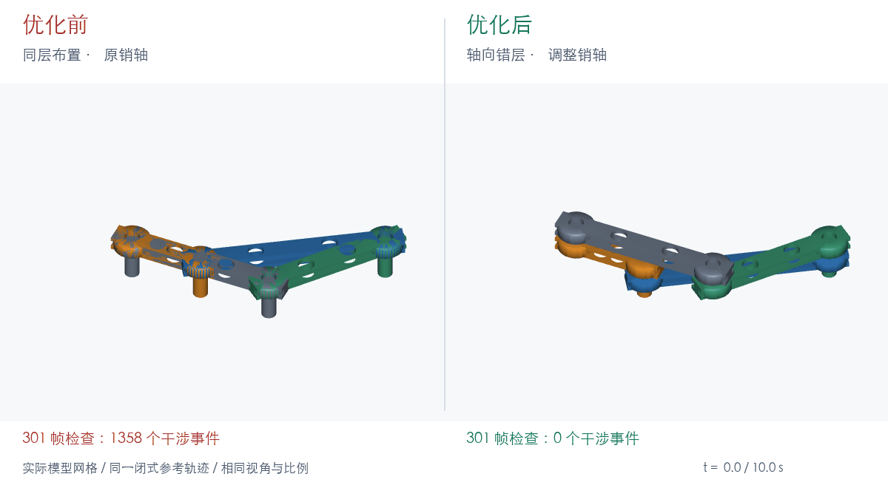

# KinCheckAPI

当前版本：**0.6.0**。[v0.6.0 更新](doc/updates/v0.6.0.md)。[v0.5.7 更新说明](doc/updates/v0.5.7.md) 介绍连续碰撞/TOI、复审修复、网格包含检测优化和完整四连杆验证；有界数值逆运动学的范围与用法见 [v0.5.6 更新说明](doc/updates/v0.5.6.md)。

[English](README.md) | 简体中文



*两份实际模型网格使用同一条闭式参考轨迹同步回放。[查看四连杆示例](examples/four_bar_linkage/verification/README_zh.md)。*

KinCheckAPI 读取 CAD 装配关系，建立机构运动模型，运行运动学仿真，并将结果导出为可独立查看的 `.kincheck` 运动包。公开 API 不暴露求解器内部对象；调用者只需操作装配体、工况、运动结果和检查报告。

## 环境要求

- Python >= 3.10
- 在独立环境安装原有仅消费 MJCF 的 API：

```bash
uv venv .venv
uv pip install --python .venv/bin/python .
```

## 插件开发版本：v0.5.7

新增可选 SimpleCADAPI addon，将经过校验的 `.scadpkg` 准备为原有 MJCF 输入。
`convert_mjcf()`、`verify(model_dir)`、装配、工况、求解和检查 API 保持不变。
CLI 修复验证器返回缺失或任意对象时被误判成功的问题。

插件运行时必须安装在与建模隔离的专用环境：

```bash
uv venv --python 3.12 "$HOME/.local/share/kincheckapi/venv"
uv pip install --python "$HOME/.local/share/kincheckapi/venv/bin/python" -e '.[addon]' -e ../CADIR
export PATH="$HOME/.local/share/kincheckapi/venv/bin:$PATH"
kincheck doctor --addon --format json
```

此开发版本配套使用相邻 CADIR 2.1.3b3 源码，修复 MJCF 导出器的 canonical 坐标帧
解码；兼容 SDK 正式发布前请使用这两个源码仓库。
探针失败必须停止并在本环境修复具体依赖。插件目前声明 macOS arm64，
SDK 兼容范围为 `>=2.1.3b3,<2.1.4`。

```bash
python scripts/package_addon.py dist/sca-kincheckapi-0.5.7
sca addon init
sca addon add ./dist/sca-kincheckapi-0.5.7
sca addon list
kincheck verify-package product.scadpkg --work-dir analysis-work --script verification/verify.py --format json
```

skill 安装名称为 `sca-kincheckapi`。产品包命令强制运行时预检，校验源包并将派生资产
保存到独立工作目录，永不修改源包。几何修改交回主 SimpleCADAPI skill 并重新 capture。
标签、单位、坐标系及发布要求见 [插件消费契约](skill_zh/doc/guides/addon-contract.md)。

## 版本记录

- **[v0.5.7](doc/updates/v0.5.7.md)**：保守连续碰撞检测、首次接触时间区间、含旋转贡献的接触点速度及失败证据保存；四连杆示例覆盖全部 36 组实体配对，并加入真实网格碰撞反例。
- **[v0.5.6](doc/updates/v0.5.6.md)**：支持范围内标量关节的有界静态数值 IK、确定性多初始值搜索、候选回代验证与结构化失败状态。
- **[v0.5.5](doc/updates/v0.5.5.md)**：路径/位姿跟踪、启停/换向、周期和协调运动检查，以及结构化诊断。
- **[v0.5.4](doc/updates/v0.5.4.md)**：运动分段、驱动跟踪、积分采样和详细曲柄滑块示例。
- **[v0.5.1](doc/updates/v0.5.1.md)**：通过机械、容纳/导向和几何关系检查装配体整体连通性。

- **v0.5.0** 统一面向 Agent 的错误和验证输出：公开错误与结果均提供 `format_for_agent()`，`str()` 输出相同的规范正文，`raise_if_failed()` 将失败转换为同源的 `VerificationError`。结构化字段仍可通过 `to_dict()` 获取。
- **v0.4.1** 移除旧 Artifact 输入路径；转换仅接受 CADIR MJCF、mapping 和网格目录。AssemblyModel → Scenario → `solve_motion()` 及下游行为保持不变。
- **v0.3.1** 统一运动结果、检查和分析的失败语义：`partial` 保留已记录的证据，但不能通过完整性验收；位置与方向残差分别使用米和弧度容差；公开阈值拒绝 NaN、无穷值和非法范围。

详见 [v0.5.1 更新记录](doc/updates/v0.5.1.md)、[运动学验证失败模式矩阵](doc/kinematic-verification-failure-modes.md) 和[空组件对失败示例](fail/04_empty_component_pairs.py)。完整历史见 [doc/updates](doc/updates)。

紧凑二级减速器与[四连杆示例](examples/four_bar_linkage/verification/README_zh.md) 统一使用 `verification/`、`model_before/`、`model_after/`、`output/`；建模源码位于各模型目录的 `source/` 中。

## 功能

- 将 CADIR MJCF、mapping 和网格目录读取并验证为不可变的 `AssemblyModel`；
- 表达 Component、Connector、Joint、Ground、传动关系、运动树和 Closure；
- 在调用后端前检查装配引用、拓扑与工况，并返回结构化诊断；
- 使用内置物理后端求解显式工况，返回与后端无关的 `MotionResult`；
- 检查闭环及一般约束残差、传动方程残差、关节限位和实测传动比；
- 计算雅可比、有效自由度、奇异性、可达性和工作空间；
- 检查目标姿态、轨迹和 connector 路径，支持关节锁定；
- 基于真实 STL 网格检查干涉、有符号最小间隙和运动包络；
- 在声明的刚体位姿插值下，跨轨迹样本连续检查显式组件对，输出带区间和 certainty 的 TOI 证据；无法证明安全时返回 `indeterminate`；
- 通过 `run_checks()` 统一执行干涉、间隙、包络、传动、限位和轨迹验收；
- 导出、验证和读取包含轨迹与网格的 `.kincheck` 结果包；
- 提供紧凑二级行星减速器、四连杆、曲柄滑块和详细导向四连杆执行机构四个示例。

## 当前边界

- 不保证任意闭环机构都能稳定完成随时间变化的位置求解；模型错误、初态不一致或不支持的机构会明确报错或返回 `partial`，不会伪装为成功；
- `partial` MotionResult 保留已记录的轨迹、残差和几何证据，其中可能包含违反约束的样本，不能据此给出通过结论；
- 离散几何检查基于显式采样时刻的真实三角网格。`check_continuous_interference()` 在声明的分段刚体插值和速度上界下增加保守区间证明；它不覆盖任意变形体或动力学运动，也不等价于精确 BREP/NURBS 曲面距离；
- 尚未实现完整动力学、接触力、摩擦和冲击；多自由度关节（`cylindrical`、`spherical`、`planar`、`free`）仍不在后端支持范围内；
- `.scadpkg` 是持久化产品源；可选 addon 校验并准备产品包，再交给原有 MJCF 转换入口，不接受原始 CADIR XML。

## 运行测试

```bash
uv run --extra test pytest -q
```

## CLI 与 Agent Skill

安装 KinCheckAPI 后，所有 Agent 环境共用 `kincheck` 运行时入口：

```bash
kincheck doctor --format json
kincheck validate-model path/to/model --format json
kincheck verify path/to/model --script verification/verify.py --format json
```

`verification/verify.py` 必须公开 `verify(model_dir)`。模型目录必须包含同一次 SimpleCADAPI 构建导出的 `scene.xml`、`scene.mapping.json` 和 `meshes/`。通过 JSON 的 `status`、`issues` 和进程退出码读取验证结果，不要解析自由文本。

生成可安装到 Codex、Gemini、Cursor、OpenCode 或 Claude Code 的 Skill：

```bash
kincheck-skill-pack --language both --archive --adapters --output-root dist
```

输出包括 `kincheckapi.tar.gz`、`kincheckapi-zh.tar.gz`，以及 `dist/adapters/claude-code/`、`codex/`、`gemini/`、`cursor-opencode/` 适配目录。Skill 只包含工作流、公开 API 参考和脚本，不包含 KinCheckAPI 源码；Python 运行时由 `kincheckapi` wheel 提供。

## 示例

紧凑二级行星减速器示例通过仿真时间序列验证传动比：

```bash
uv run python examples/compact_two_stage_planetary_reducer/verification/simulate_and_record.py
```

[四连杆示例](examples/four_bar_linkage/verification/README_zh.md) 包含优化前后模型、对应 STEP 导出和页面顶部的对比动图：

```bash
uv run python examples/four_bar_linkage/verification/simulate_and_record.py
uv run python examples/four_bar_linkage/verification/simulate_before_optimization.py
```

[曲柄滑块示例](examples/slider_crank/verification/verify.py) 是一个完整的四零件 CADIR 机构：带轴孔的曲柄座、带偏心销的轴和飞轮、两端镗孔的胶囊形连杆，以及在双导轨之间运行的滑块。验证脚本逐采样检查分段曲柄跟踪、闭环残差、关节限位、轨迹边界、网格干涉、所有零件对至少 0.5 mm 的最小间隙，以及滑块导轨包络：

仿真结果可以导出为 `.kincheck` 包，再由独立查看器回放：

```bash
uv run --extra addon python examples/slider_crank/model/source/slider_crank.cadir.py
uv run python examples/slider_crank/verification/verify.py examples/slider_crank/model
uv run python examples/slider_crank/verification/export_motion_package.py
python viewer/kincheck_viewer.py examples/slider_crank/output/slider_crank.kincheck --serve
```

[导向四连杆执行机构](examples/guided_four_bar_actuator/README.md) 提供了带加工硬件细节的完整 CADIR 装配体、独立验证脚本、离散间隙检查以及 v0.5.7 连续干涉/TOI 检查。全部 6 组刚体配对均参与检查，包括相邻关节：完整网格覆盖 28 组相对运动实体对，另对 8 组固定实体对检查初态并利用相对位姿不变性覆盖全程。详见[验证范围](examples/guided_four_bar_actuator/verification/README_zh.md)与[碰撞复核](examples/guided_four_bar_actuator/output/collision_review.md)。结果包和 JSON 证据位于 `examples/guided_four_bar_actuator/output/`：

```bash
uv run python examples/guided_four_bar_actuator/verification/verify.py examples/guided_four_bar_actuator/model --report examples/guided_four_bar_actuator/output/collision_verification.json
uv run python examples/guided_four_bar_actuator/verification/export_motion_package.py
python viewer/kincheck_viewer.py examples/guided_four_bar_actuator/output/guided_four_bar_actuator.kincheck --serve
```

独立查看器可直接回放导出的 `.kincheck` 包，无需重新运行求解器：

```bash
python viewer/kincheck_viewer.py path/to/result.kincheck --serve
```

然后打开 `http://127.0.0.1:8767/`。查看器只读取已记录的网格和轨迹。

## 结果包

`.kincheck` 是 KinCheckAPI 的运动结果格式，包含结果数据和可显示网格，不包含 HTML、JavaScript 或求解器运行时对象。通过 `kincheckapi.export` 写入、验证和读取：

```python
from kincheckapi import export

package = export.motion_package(
    assembly=assembly,
    motion_result=motion_result,
    output_path="result.kincheck",
    asset_root="examples/four_bar_linkage/model_after",
)
loaded = export.read_package(path=package.path)
```

## v0.6.0 真实物性与静力

本版交付 [E01 带载摆臂](examples/dynamics_loaded_arm/README.md)：CADIR 密度与封闭 BREP 积分、逐 occurrence 惯量、后端显式惯量、树形静力、局部 BREP 接触区域和带哈希物理结果包。未宣称逆/正动力学、接触响应、结构强度、振动或疲劳。详见[物性与静力](skill_zh/doc/guides/physical-statics.md)、[E01 requirements](examples/dynamics_loaded_arm/requirements.md)、[验证程序](examples/dynamics_loaded_arm/verification/verify.py)和[静力证据](examples/dynamics_loaded_arm/output/verification.json)。
